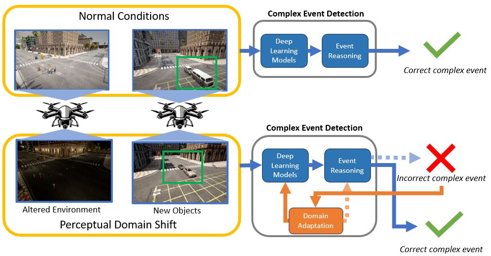
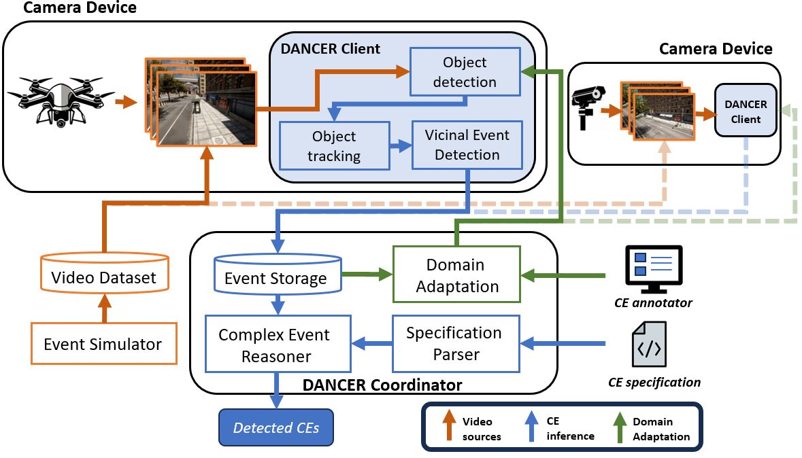

# DANCER: Domain Adaptation and Neurosymbolic inference for Complex Event Reasoning

## Introduction



Many autonomous systems today are capable of detecting a variety of interesting events, such as crimes, emergencies, etc.  These events are complex in nature, as they occur over long periods of time and span multiple different locations.  We call these autonomous systems as complex event detection systems.  However, due to the nature of these systems relying on machine learning components, they are not robust to incidents of domain shift, in particular perceptual domain shift.  These examples are shown in the motivational figure above.  Due to a lack of adaptation to these domain shifts, the performance of complex event detection is degraded.  The goal of our system, DANCER, is to enable domain adaptation in complex event detection systems.


## Overview


Our system is made up of three different processes.  The first process is simulating complex events.  As these events are rare occurrences, we can not reasonably expect humans to locate and annotate these events in a scalable manner.  To mitigate this challenge, we enable simulation of these complex events, which range from package theft to street takeovers.

The second process is complex event detection, which relies on a neurosymbolic architecture.  The neural component of this architecture runs on the DANCER client and is necessary for object detection, tracking, and detecting low level events.  The symbolic component of this architecture performs reasoning over multiple locations (sensors) and long periods of time.  

Finally, the third process is domain adaptation, which aims to fine tune the neural models used in the DANCER client with minimal user annotation effort.

## Setup

To use this repo, please clone with the necessary submodules:
```
git clone https://github.com/nesl/DANCER.git --recurse-submodules
```
Then please install all the necessary packages via
```
pip install -r requirements.txt
```

## Usage - Simulation

If you are interested in the simulation component of our system, please visit our [simulator repo](https://github.com/nesl/ComplexEventSimulator).

## Usage - Complex Event Detection

First, make sure you have some repository of video data.  You can produce these from the simulator or downloading [our dataset](https://github.com/nesl/ComplexEventDatasets).  

Second, make sure you have downloaded a [YOLOv5s model](https://github.com/ultralytics/yolov5/releases), which will be used by the DANCER client to perform object detection.  These are used in our CARLA dataset experiments, and we are currently obtaining permission to release the model used in our Soartech data.

Third, if you wish to specify new complex events, you should look at 'coordinator/LanguageCE', which contains all information necessary to write a complex event specification.

Please follow the instructions for usage depending on whether you are planning to run this system over multiple machines (i.e. with a physically separate DANCER client and coordinator) or all within the same machine.

### For single machine setup

For a single machine, you just need to open two terminals, one for the coordinator process and one for the cilent process.

On the coordinator device, execute the following command:
```
cd coordinator
python run_experiment.py --config LOCAL_FILE
```
LOCAL_FILE will change depending on whether or not you are using data generated from CARLA or our Soartech dataset.  In this case, you should be looking at either 'config/local_carla.json' or 'config/local_soartech.json' to be used as LOCAL_FILE, depending on which dataset you are using. You must also alter the 'video_folder' to point to the video dataset.

On the client device, execute the following command:
```
cd client
python client.py --config CLIENT_FILE
```
CLIENT_FILE will either be any of the 'local_*.json' files, corresponding to the dataset used.  Remember to update these config files with the corresponding ce_server_ip address of your coordinator device (e.g. your desktop machine's LAN/WAN IP) as well as the event_detector_ip address, which is your client device (e.g. the Jetson platform).  Also be sure to check if the model path is correct.


### For client-server setup

We tested our system on the Jetson TX2 platform for the DANCER client, and a Ubuntu 22 desktop machine for our coordinator.  You will need to move the 'client' folder to your client platform, and install all packages there as well.

On the coordinator device, execute the following command:
```
cd coordinator
python run_experiment.py --config REMOTE_FILE
```
REMOTE_FILE will change depending on whether or not you are using data generated from CARLA or our Soartech dataset.  In this case, you should be looking at either 'config/remote_carla.json' or 'config/remote_soartech.json' to be used as REMOTE_FILE, depending on which dataset you are using.  Remember to update these config files with the corresponding server_ip address of your coordinator device (e.g. your desktop machine's LAN/WAN IP). You must also alter the 'video_folder' to point to the video dataset.

On the client device, execute the following command:
```
cd client
python client.py --config CLIENT_FILE
```
CLIENT_FILE will either be 'remote_carla.json' or 'remote_soartech.json', corresponding to the dataset used.  Remember to update these config files with the corresponding ce_server_ip address of your coordinator device (e.g. your desktop machine's LAN/WAN IP) as well as the event_detector_ip address, which is your client device (e.g. the Jetson platform).  Also be sure to check if the model path is correct.


## Usage - Complex Event Detection cont.

Once you have run the above code, the coordinator and client should begin communicating.  First the coordinator transmits the current video, and the client will load its object detection model.  Then the client will begin to perform detection, tracking, and vicinal event detection on the video.  The results of this process will be saved in files stored under client/ae_results.

Once the experiment has completed, you should move this folder (client/ae_results) back onto the coordinator device, and analyze performance.

This can be done by executing the following commands:
```
cd coordinator
python local_analysis.py --config LOCAL_FILE  --solo_execution
```

LOCAL_FILE is the same configuration file as described earlier for single machine usage.  Even if you used a client/server setup, you should use the corresponding configuration file for the local machine.

Once this process completes, it will display the results.  

## Usage - Domain Adaptation

Now that we've obtained results from our complex event detection pipeline, we can seek to improve it under cases of perceptual domain shift.  To execute the domain adaptation process, first update the location of your video dataset and ae_results folder.  This can be found under 'CE_domain_adapt/configs/annotation_config.json'.  Then execute the following commands:
```
streamlit run test.py
```
This will open a web interface which allows for annotation of different events critical to the corresponding complex event.

The results of this annotation process will be saved under the 'annotated' folder.  Once you have obtained sufficient annotations, you can create a COCO-formatted dataset using the following commands:
```
python create_dataset.py
```
Note that you will need to update the ce_type and train_dir variables in create_dataset.py, which corresponds to the dataset used (carla or soartech) and the annotation directory.  


Next, you will need to train your YOLOv5 model on the created dataset.  This can be done by cloning the Yolov5 repo:
```
git clone https://github.com/ultralytics/yolov5.git
```
and follow their setup.  We use this repo in order to fine-tune the models.  To train a YOLOv5 model on our dataset, you will need to first describe the format of your dataset in YAML format.  See 'CE_domain_adapt/configs/coco_carla.yaml' for an example of this.  Be sure to update the path to your dataset in this YAML file.  Once you have created your YAML config file, you can move it into the yolov5 dataset format folder (yolov5/data).  Then, you can run the command training YOLOv5 on this dataset.  I've listed some examples below:
```
# For Carla Adapt
python train.py --weights yolov5s.pt --data data/coco_carla.yaml --device 1 --noval  -epochs 15

# For Carla Baseline
python train.py --weights yolov5s.pt --data data/coco_carla.yaml --device 1 --noval --epochs 15

# For Soartech Adapt
python train.py --weights soartechDetectorV2.pt --data data/soartech.yaml --device 1 --imgsz 640 --noval  --epochs 15

# For Soartech Baseline
python train.py --weights soartechDetectorV2.pt --data data/soartech.yaml --device 1 --imgsz 640 --noval  --epochs 15
```

Finally, to test your fine-tuned model, you can go back to the section on Complex Event Detection and switch out the model used by the DANCER client.


## Acknowledgements

The DANCER client uses stripped down versions of both [ByteTrack](https://github.com/ifzhang/ByteTrack) and [Yolov5 detection](https://github.com/ultralytics/yolov5).


## Links

Datasets used in this paper:
https://github.com/nesl/ComplexEventDatasets

Simulator used to generate parts of the dataset:
https://github.com/nesl/ComplexEventSimulator

Language used to specify complex events:
https://github.com/nesl/LanguageCE

## Todos

- Bugfixes and interface for coordinator/local_analysis.py
- test edge cases in detection pipeline
